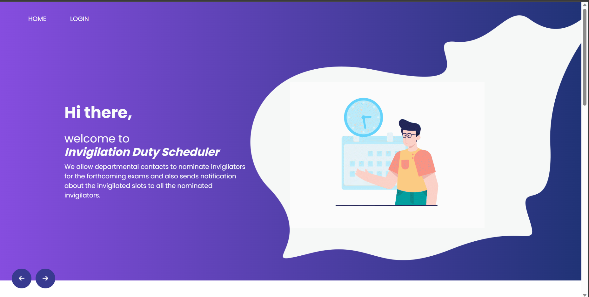

# Invigilation-Duty-Scheduler

A web portal for college faculties/invigilators to manage exam duties and to schedule themselves into specific exam halls.

  

## Features
- Modern and personalised UI.
- Dashboard view for admins and faculties.
- Tabular schedule view design for better user experience.
- Alerts users as notifications. 

### Abilities for admins
- yes, full control.
- assign and schedule faculies to exam halls based on thier availablity.
- modify/re-assign duties for faculties.
- add/remove faculties.
- on-going exam status.
- view exam time table.
- accept/decline faculty leave requests.
- add courses and subjects.
- add exams and view them.

### Abilities for faculty
- view personalised duties/schedules also general schedules.
- leave request application.
- view exam time table.
- on-going exam status.
